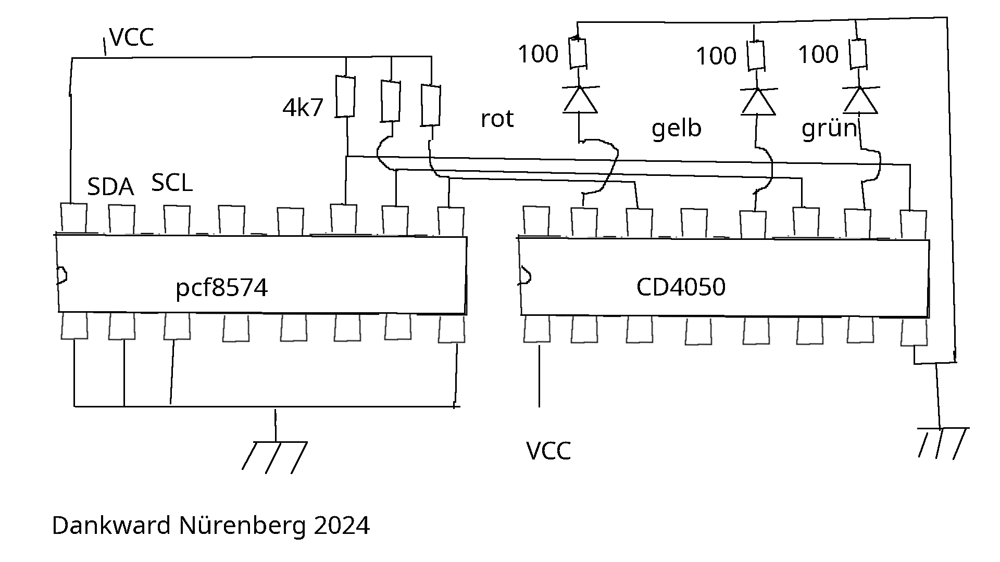

# traffic_lights
A traffic light projekt in Micropython, using the i2c-bus with pcf8574. Create two libraries pcf8574.py and ampel.py 
In this project, a traffic light is controlled via an i2c bus. It can be used, for example, to evaluate the humidity measured with the BME280.

To separate the traffic light from the measuring station, I use the i2c bus because then only 4 lines are needed. I can also use the same bus to carry out the measurement and display the result via an OLED and the traffic light.
The pcf8574 component outputs a byte that is sent over the i2c bus in parallel over the 8 ports 0-7. The ports are connected as open collectors. Therefore, they must be connected to VCC via a 4K7 resistor so that a positive signal can be recognized when the 1 state is reached.

The CD4050 is needed to ensure that enough current flows at HIGH.

The two modules pcf8574 and ampel belong together. ampel only works with this version of pcf8574. The two modules were developed on an ESP32 with the help of Thonny, they should also work on the ESP8266.
I tested them on the Raspberry pi pico and Raspberry pi+
